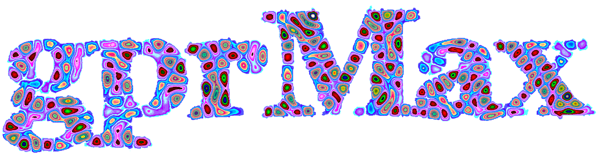
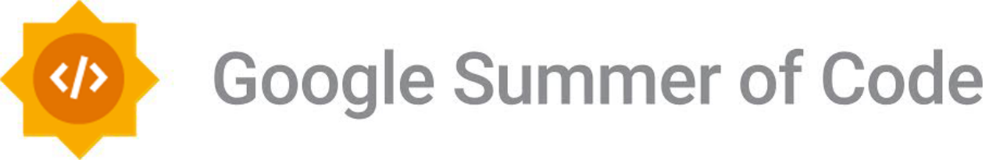

This repo is for materials relating to the participation of [gprMax](https://www.gprmax.com>) in [Google Summer of Code (GSoC)](https://summerofcode.withgoogle.com/).

gprMax was successfully selected to participate in GSoC2019 , GSoC2021 and GSoC2023. Over the course of those 2 years we had 6 students that successfully completed their projects and made important contributions to gprMax code as well as to the user community.

Our students have presented 2 conference papers at [11th International Workshop on Advanced Ground Penetrating Radar](https://www.iwagpr2021.eu/) (Malta), and submitted a paper to the [19th International Conference on Ground Penetrating Radar](https://learn.mines.edu/gpr2022/) (Colorado, USA).
